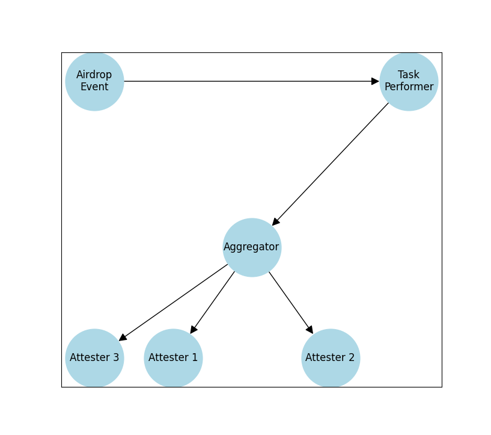

# Basedrop

Introducing an automated incentivization platform for blockchain networks that optimizes rewards based on user activity and streamlines the entire process. In our application, for instance, users can create an airdrop event, specify criteria (currently, only GitHub activity is analyzed), and the platform automatically generates a list of eligible participants. 

This runs on an Eigenlayer AVS (Actively Validated Service) powered by Othentic, ensuring that user selection is done fairly and through a decentralized process.

The L2 contracts of the AVS (`AttestationCenter` Contracts) are deployed on the ***Base Sepolia Testnet***; Contract Address - 0x7990946d9e00eb349d5F63312CE288c11071B7F4

The L1 contracts of the AVS (`AvsGovernance` Contract) are deployed on the ***Holesky Testnet***; Contract Address - 0x7436f7ACa27Ad2a7799A53C3E49f03d604dFCF07

The distribution contract (`Airdrop` Contract) responsible for taking in the list of eligible user addresses and distributing the airdrop is deployed on the ***Base Sepolia Testnet***; Contract Address - 0x3D56c673576f89fdea21Ddc27C2ef4E44b56aDF2

## Implementation

### AVS Architecture overview


## Setup
After creating necessary operators and deployer, you need to create their respective accounts. Run the following command to deploy the contracts to the respective chains mentioned above.
```bash
othentic-cli network deploy \                 
    --l1-initial-deposit 1000000000000000000 \
    --l2-initial-deposit 150000000000000000 \
    --l2-chain base-sepolia --name basedrop --eth
```
